# PROTOCOLO DE CREACIÓN SERVIDOR PARA ODOO

## 1. Dar de alta el servidor en Hetzner

Cada técnico tiene creado un proyecto en el que poder crear servidores. Las características del servidor dependerán del tipo de servicio contratado:

### a. Gestión de procesos y Gestión de clientes

El servidor para los clientes que hayan contratado el servicio de gestión de clientes (KDGC) o el servicio de gestión de procesos (KDGP) contarán con un servidor propio con las siguientes características:

- Location: Falkenstein

- Image: Ubuntu 22.04

- Tipo: arquitectura Intel x86: CPX11

- Networking: IPv4 e IPv6

- Firewalls: Firewall 3 reglas (Se activará una vez finalizada toda la instalación de Odoo)

- Backups: YES

- Placement groups: crear grupos por cada 10 servidores creados (Es decir, en cada grupo debe haber un máximo de 10 servidores/clientes)

- Nombre: nombre del cliente

Para la creación de los servidores deberemos acceder a nuestra cuenta de Hetzner y facilitar las credecianles para iniciar sesión:


En algunas ocasiones nos llevará al servicio "Cloud" que es donde accederemos a nuestro proyecto para poder crear nuestros servidores. Aunque, en otras ocasiones nos llevará a otra ventana diferente y tendremos que ir nosotros manualmente al servicio "Cloud".

Ejemplo de iniciar sesión que no nos lleve al servicio "Cloud" y que debemos hacer para llegar a este servicio:


Una vez en el servicio cloud, accedemos al proyecto que nos ha facilitado Data Control:


Para crear un servidor debemos pulsar en el botón "Add Server" y nos llevará al sistema de configuración del Servidor:


Ejemplo de configuración del servidor (Aquellas configuraciones que no aparezcan significará que se dejarán sin configurar)


El siguiente pantallazo corresponde a los grupos, recordad 10 servidores por grupos. Podéis dejarle el nombre que os da Hetzner por defecto. 


Si no habéis creado nunca un grupo debéis seleccionar "Create placement group" para crear el grupo


### b. Factura electrónica

El servicio de factura electrónica (KDFE) tiene la particularidad que se utiliza un mismo servidor para almacenar 10 clientes (salvo si tienen otro servicio de Odoo contratado). Por lo que habrá que almacenarlos en Kubernetes y no montar un nuevo servidor hasta que tengamos 10 clientes de FE. El servidor tendrá las siguientes características

1. Location: Falkenstein

2. Image: Ubuntu 22.04

3. Tipo: arquitectura Intel x86: CPX21

4. Networking: IPv4 e IPv6

5. Firewalls: Firewall 3 reglas (Se activará una vez finalizada toda la instalación de Odoo)

6. Backups: YES

7. Placement groups: crear grupos por cada 10 servidores creados (Es decir, en cada grupo debe haber un máximo de 10 servidores donde en cada servidor se alojarán 10 clientes de FE)

8. Nombre: nombre del cliente

## 2. Crear registro A del cliente

Hemos comprado el dominio datacontrolodoo.es, para cada cliente tendremos que crearle varios registros A:

- Servidor

- Portainer

- Webmin

- Nginx

- Duplicatti
1. ¿Cómo elegir el nombre del servidor cliente?
   
   Para elegir el nombre del servidor se tiene que revisar si el cliente tiene dominio propio. Para ello se consultará la ficha de contacto y si el correo electrónico del cliente tiene una extensión de dominio personalizada será ese el nombre del servidor que se usará. Ejemplo, si un cliente tiene de correo electrónico info.comercial@dwits-prueba.com se deberá utilizar su nombre de dominio "dwtis-prueba.com" para la creación de su servidor. En cambio, si el cliente no tiene ningún correo electrónico con extensión de dominio personalizada, el programador se deberá de "inventar" el nombre del servidor. Para ello se fijará en el nombre de la empresa y se usará para el nombre del servidor. Ejemplo, si un cliente tiene de correo info.comercial@gmail.com se deberá "inventar" el nombre del servidor y, para ello, nos fijaremos en el nombre de la empresa que imaginemos que sea Digital Wolf It Solutions, S.L., para este caso un ejemplo de nombre de servidor podría ser DWITS. En cambio, si el nombre de la empresa es Francisco Montes Real pues un nombre de dominio podría ser FMR.
   
   Una vez elegido el nombre del dominio deberemos acceder al Excel que os facilitaremos para la creación del acrónimo, del nombre del servidor, de las DNS y de los registros A. 
   
   Os adjunto un pantallazo usando como ejemplo dwits-prueba:
   
   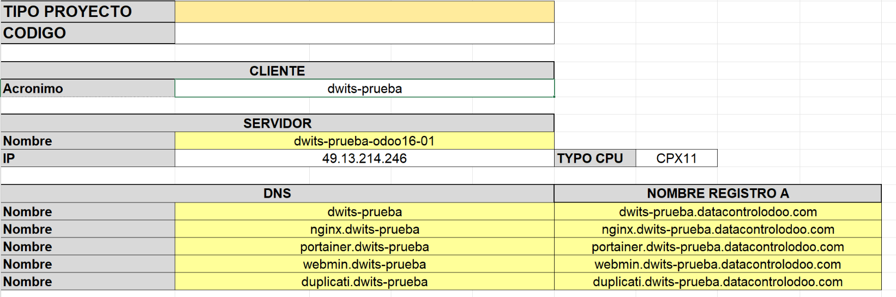
   
   La IP de los registros A será la que te ha creado Hetzner, debe ser la misma en cada uno de los registros creados para que apunten al servidor correcto.
   
   

2. ¿Cómo Crear los registros A en DONDOMINIO?

Accedemos a la siguiente URL: https://manage.panel247.com/login/
Indicamos el nombre del dominio: datacontrolodoo.com, tu usuario y contraseña

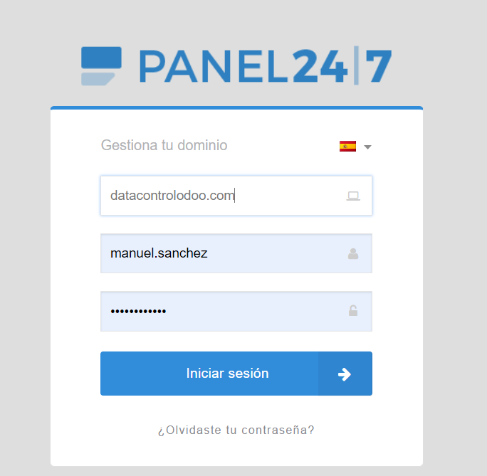

Una vez que accedamos al panel principal, nos dirigiremos a la sección "ALOJAMIENTO" y una vez dentro de esta sección pulsaremos en "Zona DNS".

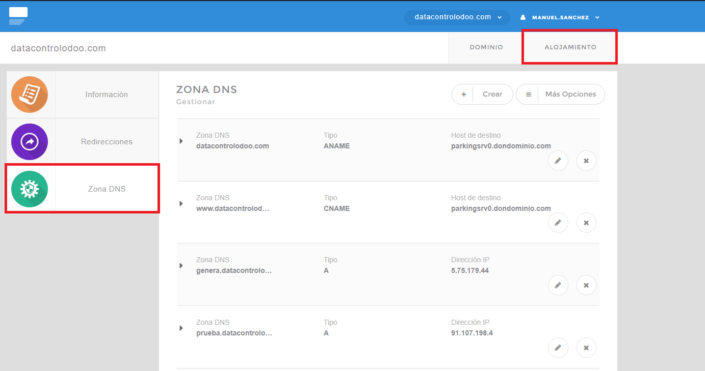

Creamos los registros A que hemos indicado anteriormente. Siguiendo el ejemplo serían los siguientes:

- Servidor: dwits.datacontrolodoo.com   

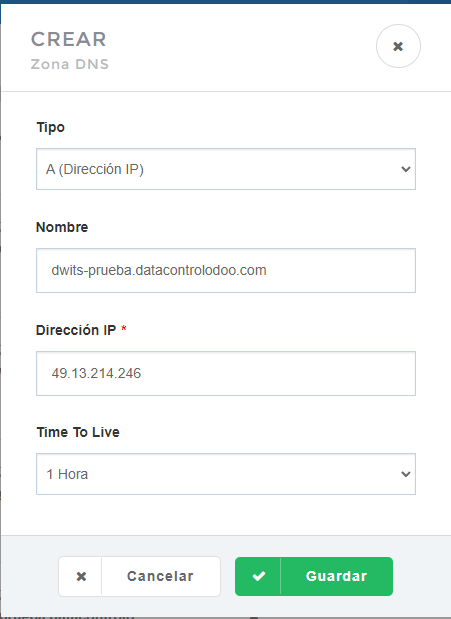

- Nginx: nginx.dwits.datacontrolodoo.com            


- Portainer: portainer.dwits.datacontrolodoo.com            

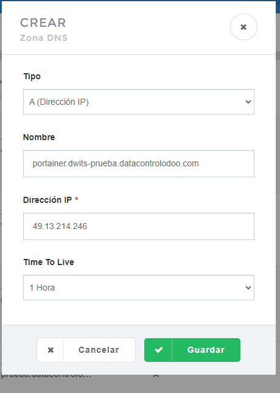

- Webmin: webmin.dwits.datacontrolodoo.com            

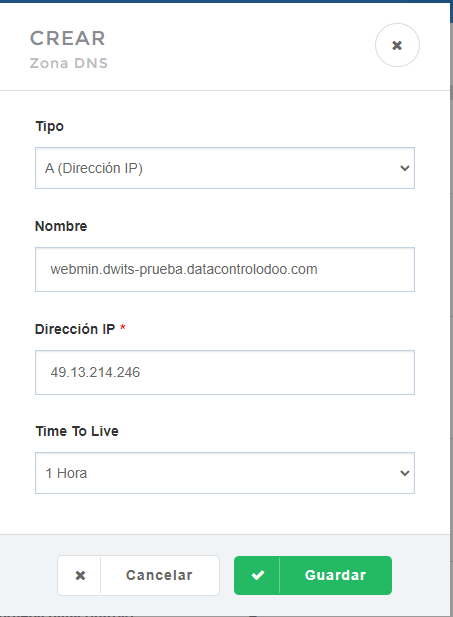

## 3. Instalaciones en el servidor

1. Primeros pasos en el terminal

Abrimos el terminal que utilicemos para conectar por SSH y añadimos la IP del servidor de Hetzner y el puerto 22.
Cuando entras por root a un servidor de Hetzner te solicita la contraseña que previamente te ha enviado al correo electrónico y que crees una contraseña nueva.


Una vez cambiada la contraseña, debemos actualizar la lista de paquetes disponibles de nuestro servidor Ubuntu y luego instalar las actuliaciones disponibles para los paquetes instalados.

```
sudo apt update && sudo apt upgrade
```

Durante la instalación nos pedirá confirmación para proseguir con la instalación de las actualizaciones donde para proseguir debemos indicar que sí (Y).

Una vez finalizada la tarea, nos solicita que reiniciemos los servicios marcados para que el servidor utilice los nuevos paquetes, donde le diremos "Ok".


Si no os salierá esta ventana no os preocupeis, ya que salga o no esta ventana realizamos un reinicio del sistema operativo de manera segura y ordenada con el siguiente comando:

```
reboot
```

Una vez ejecutado el comando se desconectará nuestro terminal debiendo  conectarnos de nuevo. Importante, la contraseña de vuestro terminal seguirá teniendo la contraseña que nos dio el servidor y que como recordaréis la hemos cambiado, por ello os recomendamos que se cambie el campo password con la nueva contraseña que le hemos indicado a nuestro servidor Ubuntu.


- Para ejecutar la consola pulsamos en "New Terminal console".


2. Clonación intalación Odoo

A continuación, utilizaremos el comando que utiliza Git clonar (copiar) el repositorio remoto llamado "Install-Odoo" desde GitHub al directorio local actual en tu máquina. Esto te permite obtener una copia local completa del repositorio para trabajar con ella offline o hacer modificaciones.

```
git clone https://github.com/datacontrolTI/Install-Odoo.git
```


3. Configuración Inicial y Ejecución de Scripts para Odoo
- Empezamos cambiando el directorio actual al directorio llamado "Install-Odoo"

```
cd Install-Odoo
```


- Listamos los archivos y directorios en el directorio actual para comprobar que estamos en el directorio "Install-Odoo"

```
ls
```

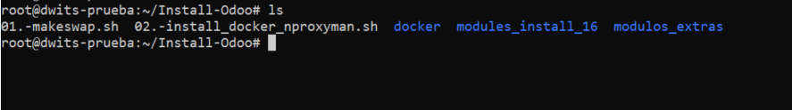

- Otorgamos permisos de ejecución a todos los archivos con extensión ".sh" en el directorio actual, de forma recursiva. Es decir, el comando se aplicará no solo a los archivos en el directorio actual, sino también a todos los archivos dentro de subdirectorios que estén bajo el directorio actual.

```
chmod -R +x *.sh
```

- Nuevamente, listamos los archivos y directorios en el directorio actual para verificar cambios en los permisos

```
ls
```

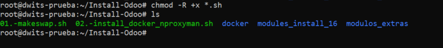

- Ejecutamos el script llamado "01.-makeswap.sh", el cual está diseñado para realizar configuraciones específicas, como configurar espacio de swap. El espacio swap es una sección del disco duro que el sistema operativo utiliza como una extensión de la memoria RAM. Cuando la RAM se llena, el sistema puede mover datos temporales a este espacio swap para liberar memoria RAM y seguir funcionando sin problemas. En resumen, el espacio de swap actúa como un "colchón" de seguridad que ayuda a manejar situaciones de alto uso de memoria, lo que es especialmente importante en servidores o sistemas que ejecutan aplicaciones que consumen muchos recursos.

```
./01.-makeswap.sh
```

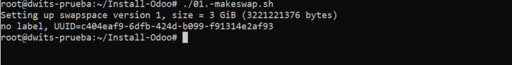

- Por último, verificamos visualmente la asignación y uso actual del espacio de swap en el sistema.

```
htop
```


Para salir de esta ventana pulsamos en el teclado F10 o Ctrl + C

## 4. Instalación de Docker

Ejecutamos el script que esta diseñado para la instalción de Docker y otros servicios complementarios. Este script está ubicado en la carpeta "02" del repositorio que se clonó previamente.

```
./02.-install_docker_nproxyman.sh
```

Durante la ejecución del script, se debe especificar la versión de Docker que se desea instalar, en este caso, indicaremos la opción 4 que es una versión compatible con Ubuntu 22.04.

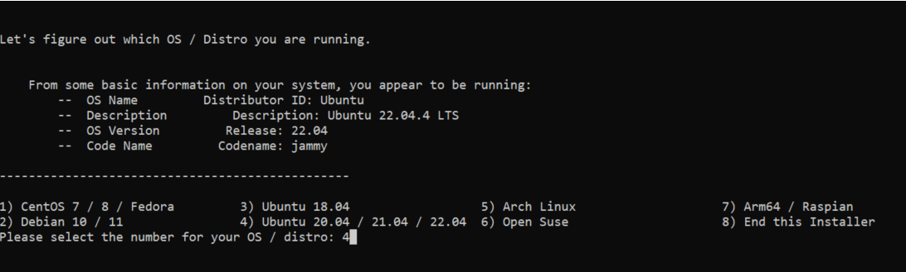

Seguidamente, el scrip presentará una serie de preguntas (sí/no) para elegir que componentes adicionales instalar junto con Docker. Las opciones son:

- **Docker-CE (Community Edition)**: Es la edición comunitaria de Docker, necesaria para crear y ejecutar contenedores Docker --> Y

- **Docker-Compose**: Herramienta para definir y ejecutar aplicaciones multi-contenedor Docker --> Y

- **NGinX Proxy Manager**: Permite gestionar fácilmente un servidor proxy NGinX, pero en este caso se elige no instalarlo --> n

- **Navidrome**: --> n

- **Portainer-CE (Community Edition)**: Interfaz gráfica que facilita la gestión de contenedores Docker --> Y

- **Remotelu – Remote Desktop Support**: Software de soporte de escritorio remoto, pero se elige no instalarlo --> n

- **Guacamole – Remote Desktop Protocol in the Browser**: Herramienta para acceder a escritorios remotos a través de un navegador--> n

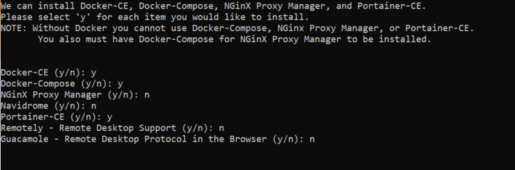

## 5. Instalación del Portainer

Después de instalar Docker usando el script, el proceso de instalación continua con la configuración de Portainer, que es una herramienta de gestión para Docker. Aquí te explico paso a paso cómo se desarrolla esta parte:

1. **Selección de la versión de Portainer**: Al finalizar la instalación de Docker, el script te preguntará qué versión de Portainer deseas instalar. Se debe elegir la opción de "instalación completa" de Portainer Community Edition (Full Portainer-CE), que incluye todas las características y funcionalidades disponibles.
   
   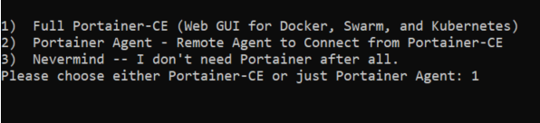

2. **Configuración del puerto para Portainer**: Una vez instalado Portainer, el script te informará sobre el puerto en el que Portainer está escuchando. Normalmente, Portainer se configura para utilizar el puerto 9000. Este puerto es donde podrás acceder a la interfaz web de Portainer.

3. **Acceso a Portainer a través del navegador**: Para acceder a Portainer, debes abrir el navegador de tu elección y escribir la dirección IP del servidor seguida del puerto en el que Portainer está operando. Por ejemplo, si la dirección IP del servidor es `49.13.214.246` y Portainer está en el puerto `9000`, ingresarías `49.13.214.246:9000` en la barra de direcciones de tu navegador.
   
   Esto te llevará a la interfaz web de Portainer, donde puedes comenzar a configurar y gestionar tus contenedores Docker. Desde allí, podrás desplegar, monitorear y administrar contenedores, imágenes, redes, y volúmenes de Docker de manera intuitiva y eficiente.
   
   Este procedimiento facilita la gestión de entornos Docker, especialmente en escenarios donde se manejan múltiples contenedores, haciendo que la administración sea más accesible y visual.

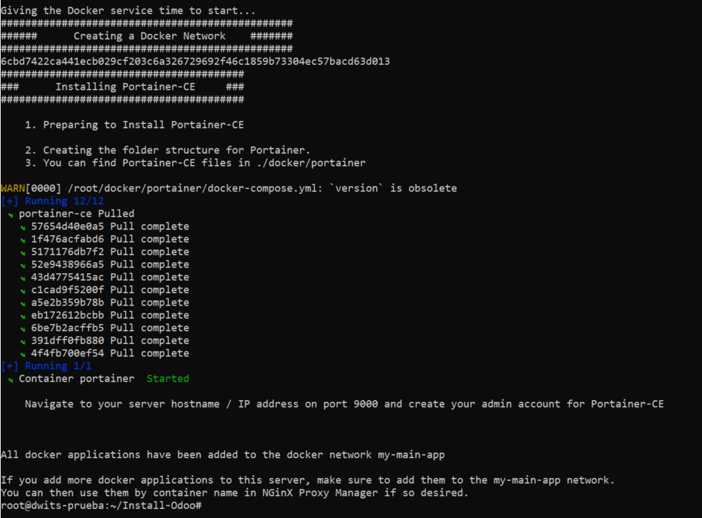

Al poner la IP con el puerto (49.13.214.246:9000) te pedirá que establezcas una contraseña antes de entrar. Una vez dada, pulsamos en el botón "Crear usuario".


*Posible problema*


El mensaje que ves indica que la instancia de Portainer se ha desactivado temporalmente por motivos de seguridad, probablemente debido a que la sesión inicial de configuración superó el tiempo máximo permitido sin actividad. Esto es una medida de seguridad para prevenir accesos no autorizados durante la configuración inicial.

**Para resolver este problema y continuar con la configuración de Portainer, sigue estos pasos:**

- **Reiniciar Portainer**: Necesitas reiniciar el servicio de Portainer en el servidor. Esto dependerá de cómo Portainer esté desplegado (por ejemplo, como un contenedor Docker). Un comando común para reiniciar Portainer si está corriendo en Docker sería:

```
docker restart [container_id]
```

Sustituye `[container_id]` con el ID del contenedor de Portainer. Si no conoces el ID, puedes obtenerlo con el comando:

```
docker ps
```


- **Acceder nuevamente**: Una vez reiniciado, vuelve a acceder a Portainer usando la URL en tu navegador con la dirección IP del servidor y el puerto especificado (generalmente 9000), como `49.13.214.246:9000`. (Sustituye la IP por la de tu servidor)

- **Crear el usuario rápidamente**: Completa el formulario de creación de usuario lo más pronto posible para evitar otro timeout.

Una vez creado el usuario satisfactoriamente, se te redirigirá la página al menú principal.


### A. Añadir entorno

1. **Acceso al apartado Environments**: En la interfaz de usuario de Portainer, utiliza el menú lateral para navegar al apartado "Environments". Este apartado permite gestionar diferentes entornos donde tus contenedores y servicios van a operar.
   
   

2. **Configuración del entorno**: Dentro del environments que vendrá creado por defecto "local", debes añadir la dirección IP de tu servidor. Esto permite a Portainer conectar y gestionar los contenedores en ese servidor específico. Tras facilitar la IP, pulsaremos en el botón "Update Environment" para que se actualice la información y la IP quede guardada.
   
   

3. **Creación de Stacks**: Una vez que el entorno está configurado, deberemos crear los diferentes stacks necesarios para la instación de Odoo y será el stack "Odoo 16"  y stack "NGinx".
   
   Para ello debemos volver al menú principal pulsando en "Home". Y en el menú principal accederemos al environments que se nos ha creado por defecto llamado "local", que es el mismo al que le acabamos de facilitar la IP.
   
   
   
   Una vez accedido al environment, debemos acceder al apartado "Stack" bien en el menú lateral o con el acceso directo que nos aparece en la pantalla principal del environments "local".
   
   
   
   Al acceder, veremos que ya hay un stack creado  de forma predeterminada llamado "portainer" el cual permitirá su administración, probablemente relacionado con la instancia de Portainer misma. Aquí, debes proceder a añadir más stacks para tus aplicaciones pulsando en el botón superior del extremo derecho llamado "+ Add Stack". 
   
   
   
   A continuación, indicaremos como añadir cada uno de los stacks a través del siguiente enlace [odoo_install/docker at main · datacontrolTI/odoo_install · GitHub](https://github.com/datacontrolTI/odoo_install/tree/main/docker):
   
   
   
   - **Odoo 16**:
     
     - **Localización del archivo de instalación**: Dentro del repositorio de GitHub al que accedes mediante el enlace anterior, encuentra el archivo `odoo16.txt`, el cual contiene el código necesario para la instalación de Odoo 16.
     - **Configuración del stack**: Accede a la creación del Stack y facilita primero su nombre "Odoo16" y en su editor web (Web Editor) pega el contenido del archivo `odoo16.txt`
     
     
     
     - **Desarrollo del Stack**: Finaliza la configuración del stack dando clic en el botón "Deploy the stack", lo que iniciará el proceso de despliegue de Odoo 16 en el entorno configurado.
   
   - **NGinX**:
     
     - **Localización del archivo de instalación**: Similar al proceso de Odoo, encuentra el archivo `nginx.txt` en el mismo repositorio de GitHub al que accedes mediante el enlace facilitado.
     
     - **Configuración en Portainer**: Accede a la creación del Stack y facilita primero su nombre "nginx" y en su editor web (Web Editor) pega el contenido del archivo `nginx.txt`.
       
       
     
     - **Desarrollo del Stack**: Al igual que con Odoo, finaliza la configuración y lanza la instalación de NGinX haciendo clic en el botón "Deploy the stack".
     
     Una vez instalado los dos stacks, deben encontrarse estos dos en la tabla "Stack list".
     
     

## 6. Instalación de los módulos OCA

1. **Finalización de la Instalación de Stacks en Portainer**:
   Después de instalar Odoo y otros servicios mediante stacks en Portainer, tu próxima tarea es enriquecer la funcionalidad de Odoo instalando módulos adicionales de la OCA (Odoo Community Association). Los módulos de la OCA aportan funcionalidades adicionales y mejoras comunitarias a las aplicaciones estándar de Odoo.

2. **Preparación para la Instalación de Módulos**:
   Antes de proceder con la instalación de los módulos OCA, necesitas preparar el entorno en el servidor donde se está ejecutando Odoo. Esto implica verificar el entorno y asegurarse de que todas las herramientas necesarias estén instaladas. Para ello cerramos nos desconectamos del servidor y nos volveríamos a conectar (cerrando previamente la terminal de la consola si la tuvieramos abierta).
   
   - Cerramos consola
   
   
   
   - Nos desconectamos del servidor pulsando en el botón "Log Out".
     
     
   
   - Nos volvemos a conectar al servidor pulsando en el botón "Log in" y abrimos una nueva consola.
     
     
   
   - Para ejecutar la consola pulsamos en "New Terminal console".
   
   
   
   - A continuación, instala "Midnight Commander" (mc), un gestor de archivos basado en texto para Unix como Ubuntu. Midnight Commander es útil para navegar por los archivos de sistema de una manera más intuitiva que los comandos de terminal estándar. Durante la instalación te solicitará la instalación de varios paquetes adicionales donde le diremos que sí lo instale (Y).
   
   ```
   sudo apt install mc
   ```
   
   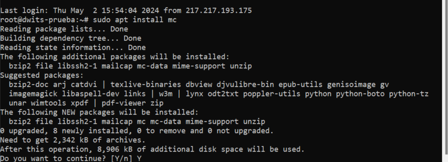
   
   Finalizada la instalación aparecerá una ventana como la siguiente:
   
   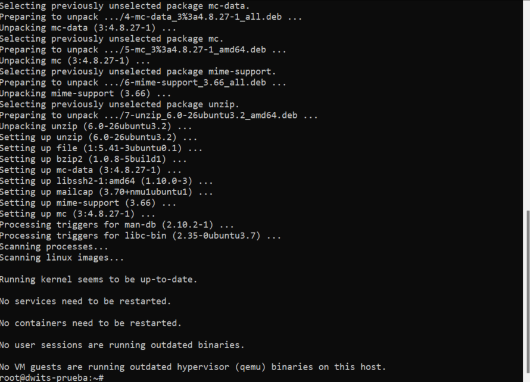
   
   - Una vez instalado, ejecutas Midnight Commander. Esto te permitirá navegar por los directorios de tu servidor de manera gráfica en la terminal, facilitando la tarea de localizar y manipular los archivos necesarios para la instalación de los módulos OCA.

```
mc
```

Una vez ejecutado Midnight Commander, nos aparecerá una ventana como la siguiente:

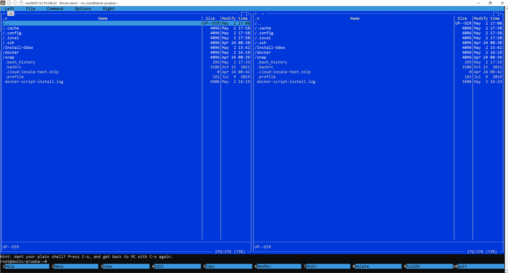

Como podéis observar la interfaz se divide principalmente en dos paneles que facilitan la gestión de archivos y directorios:

1. **Panel Izquierdo y Derecho**: Cada panel muestra el contenido de un directorio. Esto permite realizar operaciones de archivo como copiar o mover archivos entre directorios de una manera muy visual y directa. Puedes cambiar entre los paneles usando la tecla `Tab`.

2. **Barra de Menús en la Parte Inferior**: En la parte inferior, verás una barra de menú con números que corresponden a diferentes funciones accesibles mediante el teclado. Por ejemplo, `F5` se usa para copiar archivos de un panel al otro, y `F8` se usa para borrar archivos. También puedes acceder a estas funciones usando el ratón o el teclado.
   
   - **F1**: Help - Ayuda sobre cómo usar Midnight Commander.
   - **F2**: Menu - Accede a un menú contextual con más opciones.
   - **F3**: View - Permite ver el contenido de un archivo seleccionado.
   - **F4**: Edit - Abre un archivo seleccionado en un editor de texto.
   - **F5**: Copy - Copia archivos o directorios.
   - **F6**: RenMov - Renombra o mueve archivos o directorios.
   - **F7**: Mkdir - Crea un nuevo directorio.
   - **F8**: Delete - Elimina archivos o directorios.
   - **F9**: PullDn - Activa la barra de menús superior.
   - **F10**: Quit - Sale de Midnight Commander.

3. **Línea de Comando**: Justo debajo de los dos paneles, hay una línea de comando donde puedes escribir comandos directamente, como si estuvieras en la terminal normal de Linux.

Una vez explicada la interfaz procederemos a copiar el fichero "20. -odoo.conf" que lo encontraremos en el panel de la izquierda para ello debemos irnos al directorio superior del que nos encontramos y para ello debemos seleccionar "/..". Para acceder a el podamos darle directamente con el mouse de nuestro ratón. 

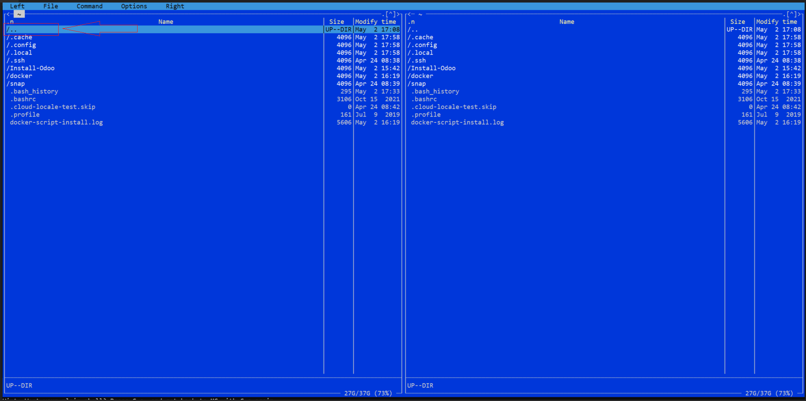

Una vez en el directorio superior accedemos a la carpeta root

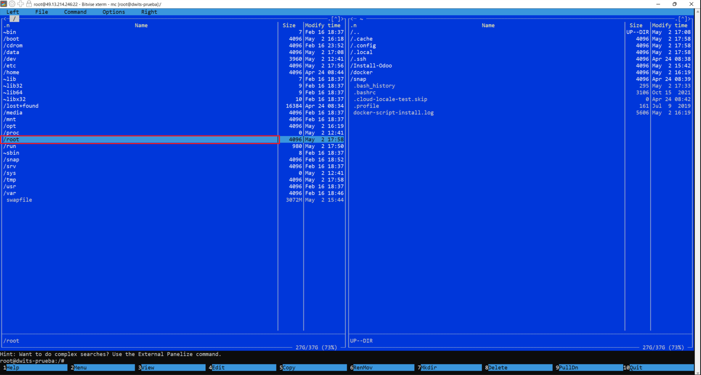

Después, accedemos a la carpeta Install-Odoo

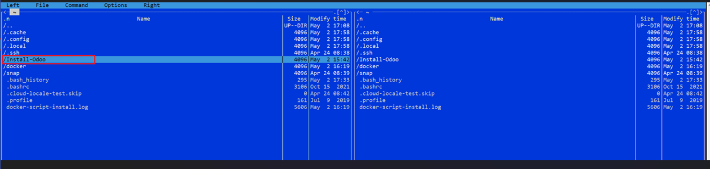

Seguidamente, a la carpeta /modules_install_16

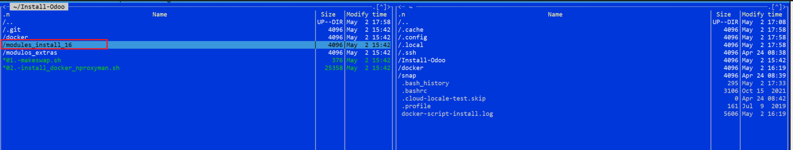

Bien, ahora debemos irnos al panel superior del panel de la derecha pulsando en "/.."  

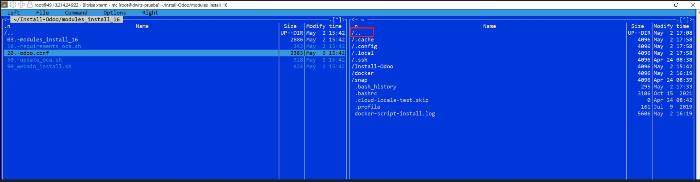

Una vez que el panel de la derecha se encuentra en el nivel superior, debemos irnos al panel de la izquierda y nos situamos en el archivo 20. -odoo.conf y pulsamos con el ratón en el número 5 "Copy" del panel inferior para copiar (o pulsando en el teclado la tecla F5) y nos aparecera una ventana de diálogo donde ingresariamos la ruta donde la queremos copiar y para ello introduciremos la ruta donde dice "to" y una vez introducida pulsaremos en el botón "OK". La ruta sería:

```
data/compose/1/config/
```

Para pegar la ruta solo debemos situarnos en el campo "to" y pulsar en el teclado Shift+Insert para pegar desde el portapapeles. Esta combinación de teclas puede variar dependiendo del emulador de terminal que estés utilizando (por ejemplo, en algunos puede ser Ctrl+Shift+V). Una vez copiada la ruta pulsamos el botón "OK".

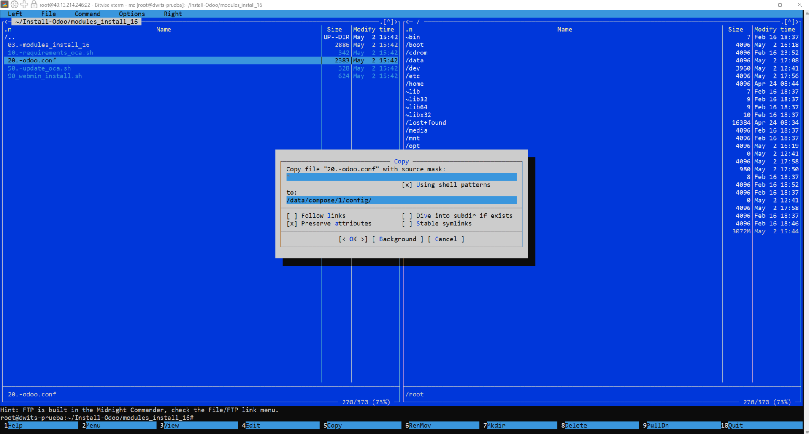

Para comprobar que el archivo se ha copiado correctamente y cambiarle el nombre del archivo, accederemos en el panel derecho a la ruta data/compose/1/config/. Para acceder solo debemos ir pulsando con el ratón en los nombres de las carpetas que se indican en la ruta dada hasta llegar a donde debe estar el archivo copiado.

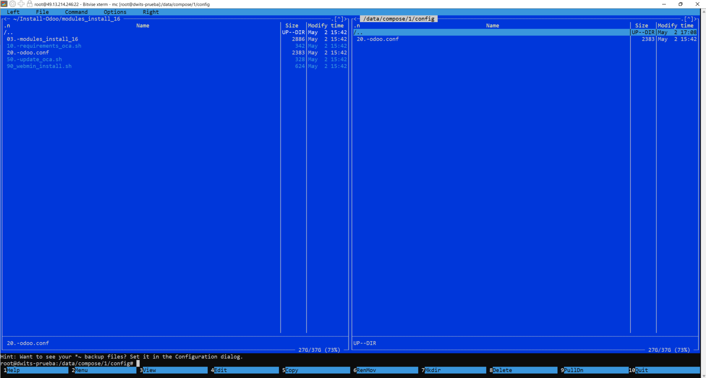

Para cambiar el nombre del archivo que se encuentra copiado en el panel de la derecha, nos situamos encima del archivo y pulsamos en el panel inferior el número 6 "RenMov" (o pulsando en el teclado F6). Seguidamente, nos aparecere una ventana de diálogo donde para cambiar el nombre eliminamos todo lo que nos aparece en el campo to y le ponemos lo siguiente: 

```
odoo.conf
```

*Ventana diálogo antes de cambiar el nombre*

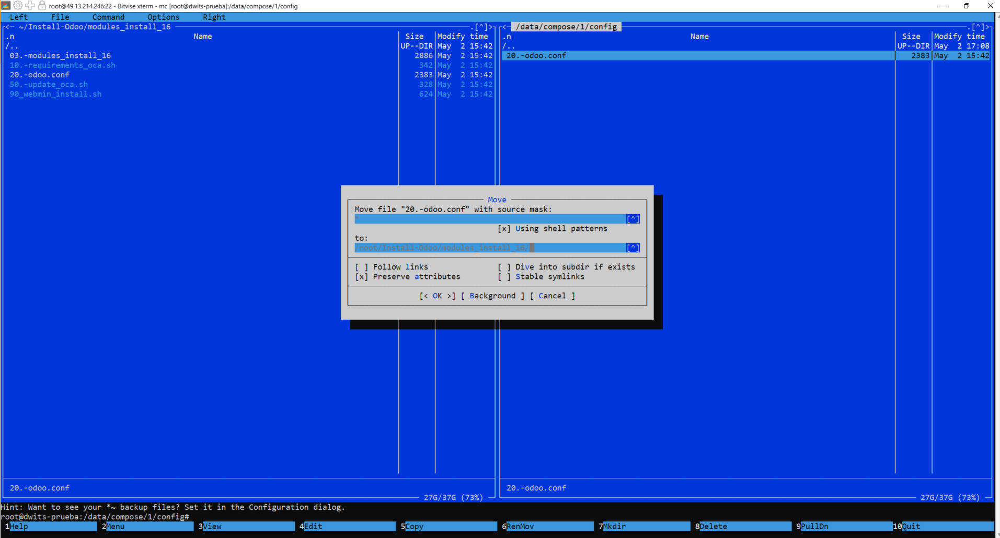

*Ventana diálogo después de cambiar el nombre*

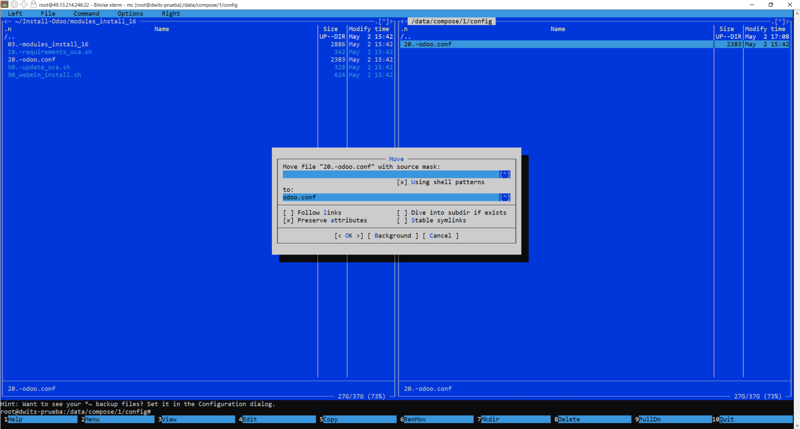

Para aceptar el cambio de nombre pulsamos en "OK".

Una vez cambiamos el nombre, seleccionamos (odoo.conf) y pulsamos en el menú inferior al número 4 "Edit" o pulsamos F4 y nos aparecerán los siguiente:


Donde elegiremos la opción número 1 /bin/nano/ o lo que es lo mismo, seleccionamos nano porque es un editor de texto sencillo, fácil de usar y tiene funciones esenciales para editar archivos en un entorno de línea de comandos. Donde nos aparecerá la siguiente pantalla:

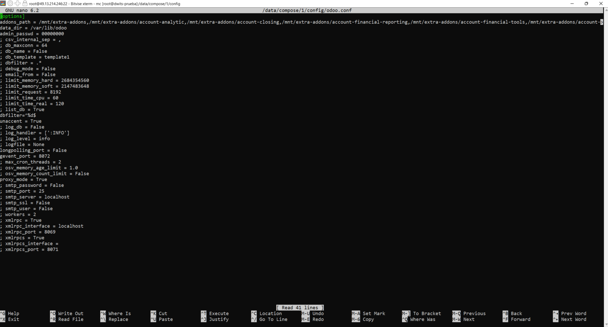

En esta pantalla no tenemos que hacer nada, por lo tanto, saldremos de ella pulsando en el teclado Ctrl + X. Al salir de ella volveremos de nuevo a la pantalla de Midnight Commander (pantalla azul con los dos paneles).

Seguidamente, volvemos a portainer y en nuestro environments "local" accedemos a los stacks que creamos y accedemos al stack que creamos con el nombre odoo16.

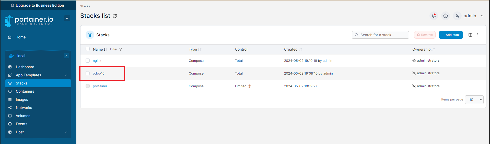

Una vez dentro del stack, seleccionamos los dos contenedores que hay creado "odoo16-db-1" y "odoo16-web-1", y los reiniciamos pulsando en el botón "Restart".


Una vez reiniciados los contenedores, es el momento de instalar los módulos OCA. Para ello volvemos nuevamente a nuestra consola donde en el panel de la izquierda debemos copiar el archivo "03. -modules_install_16" en el panel de la derecha en directorio data/compose/1/addons. Para ello, en el panel de la derecha debemos subir de directorio pulsando en "/..". En este momento, deberíais estar en una ventana parecida a la siguiente:

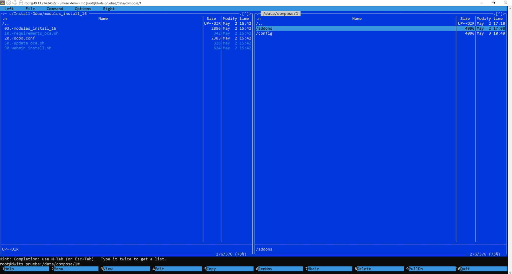

Seguidamente, accedéis a la carpeta "/addons" y dentro de esta carpeta será donde copiemos el archivo 03. -modules_install_16 del panel de la izquierda. Para copiar el archivo, nuevamente debemos pulsar con el ratón en el número 5 "Copy" del panel inferior para copiar (o pulsando en el teclado la tecla F5) y nos aparecerá una ventana de diálogo donde en esta ocasión dejaremos la ruta que nos aparece en "to" ya que en el panel de la derecha se encuentra dentro de la ruta que debe estar (para saber en que ruta estamos debemos fijarnos en la ruta que nos aparece en la parte superior del panel que corresponda, en este caso en el panel de la derecha). Confirmado que la ruta que aparece en to es "/data/compose/1/addons/", pulsaremos en el botón "OK".

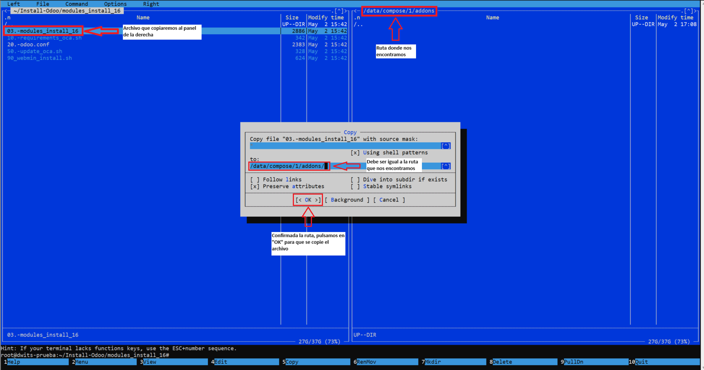

Una vez copiado el archivo, nos salimos del Midnight Commander bien pulsando en la barra inferior el número 10 "Quit" (o pulsando en el teclado F10). Una vez fuera de la consola, debemos asegurarnos que nos encontramos en la ruta /data/compose/1/addons y para ello ejecutamos en la consola el siguiente código:

```
cd /data/compose/1/addons
```

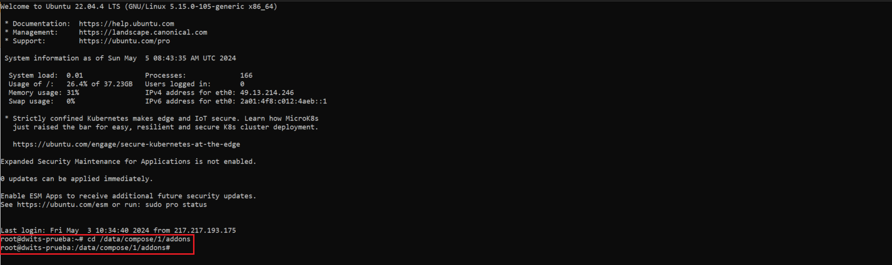

Confirmado que nos encontramos en la ruta apropiada, debemos renombrar el fichero  `03.-modules_install_16` para que tenga la extensión `.sh`, convirtiéndolo en un script de shell. Esto es útil para indicar que el archivo contiene un script que puede ser ejecutado en la terminal.

```
mv 03.-modules_install_16 03.-modules_install_16.sh
```

A continuación, otorgamos permisos de ejecución al archivo `03.-modules_install_16.sh`. Al usar `chmod +x`, estás marcando el archivo como ejecutable, lo que significa que puede ser ejecutado directamente como un programa o script en la línea de comandos.

```
chmod +x 03.-modules_install_16.sh
```

Por último, ejecutamos `03.-modules_install_16.sh`. El prefijo `./` se usa para indicar que el script debe ejecutarse desde el directorio actual. Este script contiene instrucciones para instalar o configurar los módulos OCA en Odoo.

```
./03.-modules_install_16.sh
```

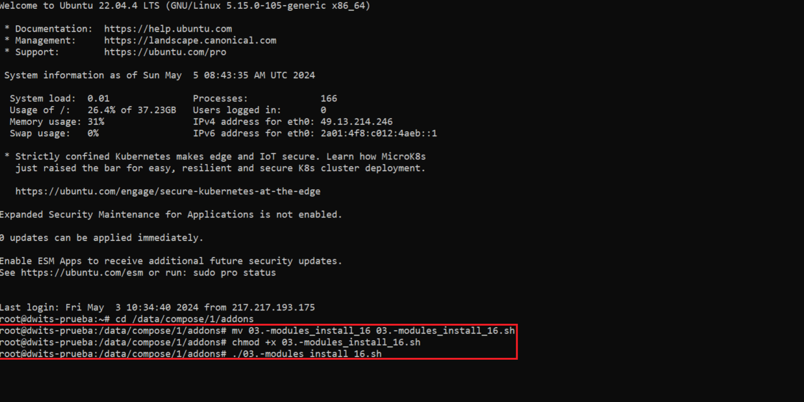

Después de descargar los archivos necesarios para tu proyecto Odoo, es esencial instalar las librerías y herramientas de apoyo que permitan gestionar y operar contenedores Docker eficientemente. Esto incluye Docker Community Edition (CE), el Docker CLI, y plugins adicionales para Docker, como `docker-buildx` y `docker-compose`.

- **Definir la variable de versión**: 
  
  Antes de instalar Docker y sus herramientas, es necesario definir una variable de versión (`VERSION_STRING`) que especificará la versión de Docker que es compatible con tu versión de Ubuntu. Esto garantiza que se instale la versión correcta y optimizada para tu sistema operativo.

```
VERSION_STRING=5:25.0.5-1~ubuntu.22.04~jammy
```

- **Instalar Docker y complementos**:

Utiliza el siguiente comando para instalar Docker CE, la interfaz de línea de comandos de Docker (`docker-ce-cli`), y otros plugins necesarios para el manejo avanzado de imágenes y composiciones de contenedores.

```
sudo apt-get install docker-ce=$VERSION_STRING docker-ce-cli=$VERSION_STRING containerd.io docker-buildx-plugin docker-compose-plugin
```

Este comando instala:

**docker-ce**: Docker Community Edition, la plataforma principal para contenedores.

**docker-ce-cli**: La línea de comandos de Docker, que permite interactuar con Docker desde el terminal.

**containerd.io**: Un entorno de ejecución de contenedores que Docker utiliza.

**docker-buildx-plugin**: Un plugin de Docker que proporciona capacidades de construcción extendidas.

**docker-compose-plugin**: Un plugin que facilita la definición y ejecución de aplicaciones multi-contenedor con Docker Compose.

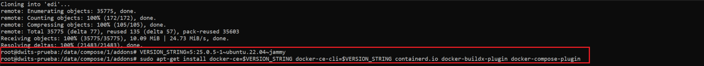

Durante la instalación se indica que la instalación de Docker resultará en el **downgrade** (reemplazo de una versión más reciente por una anterior) de algunos paquetes (`docker-ce` y `docker-ce-cli`), y te pregunta si deseas continuar con este proceso, donde se dira que sí (Y).

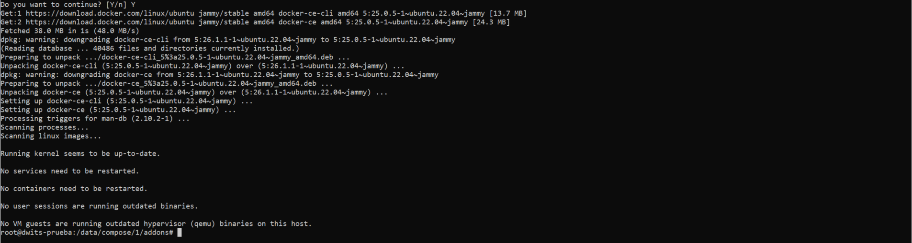

- **Reinicio del sistema**:

Después de instalar Docker y sus herramientas, es recomendable reiniciar el sistema para asegurar que todas las nuevas configuraciones tomen efecto y que los servicios de Docker se inicien correctamente.

```
sudo reboot
```

En resumen, estos pasos garantizan que tu servidor esté equipado con las herramientas necesarias de Docker para desplegar y manejar el contenedor de Odoo16-web de manera eficiente, aprovechando las últimas tecnologías y plugins disponibles para Docker en Ubuntu 22.04.

Al realizar el reboot, tendremos que cerrar la consola y volveremos a conectanos. 

- Cerramos consola


(La imagen utilizada ha sido reusada de pantallazos anterior, por lo tanto, no os fijeis del código que aparece)

- Nos desconectamos del servidor pulsando en el botón "Log Out".
  
  

- Nos volvemos a conectar al servidor pulsando en el botón "Log in" y abrimos una nueva consola.


Para ejecutar la consola pulsamos en "New Terminal console".


Una vez dentro de la consola volvemos a ejecutar Midnight Commander.

```
mc
```

Una vez dentro, nos situamos en el panel de la izquierda, accederemos al directorio /root/Install-Odoo/modules_install_16 y, después, nos situamos en el derecho y accedemos a la ruta /data/compose/1/addons. Para este caso, debemos acceder al nivel superior pulsando en "/.." para que nos aparezca la carpeta "data". Para comprobar que estamos en la ruta correcta solo nos debemos fijar en la ruta que nos aparece en la parte superior de cada panel.

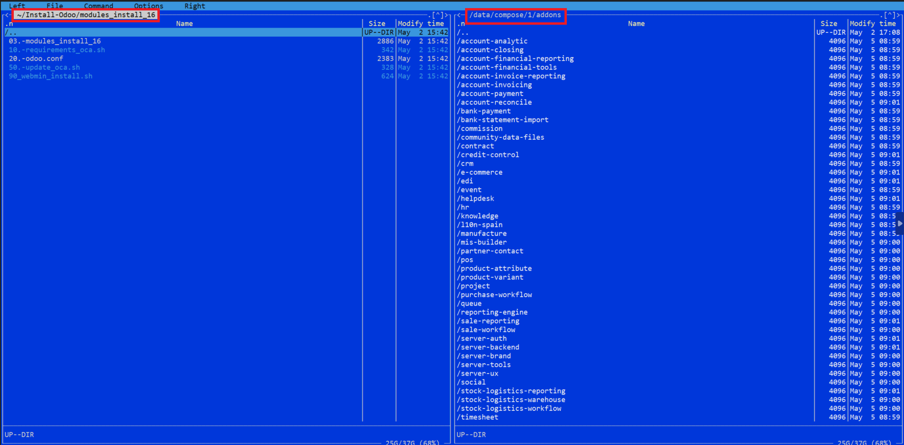

Una vez confirmado que estamos en la ruta correcta copiamos el archivo "./10.-requirements_oca.sh" que se encuentra en el panel de la izquierda y lo copiamos al panel de la derecha (Para copiar o pulsamos en el panel inferior el número 5 Copy o pulsamos F5). Para comprobar que se ha copiado correctamente, nos situamos en el panel de la derecha y bajamos al final de este panel donde encontraremos el archivo recién copiado.


Una vez copiado, salimos de Midnight Commander pulsando en el panel inferior en el número 10 "Quit" o pulsando en F10. Y una vez quitado Midnight Commander, hacemos en la consola un reboot.

```
reboot
```

A continuación, cerrar la consola y a conectarnos de nuevo, siguiendo los pasos dados antes de ejecutar Midnight Commander y copiar el archivo "./10.-requirements_oca.sh". Una vez dentro de la consola cambiamos el directorio actual a `/root/Install-Odoo/modules_install_16`, que es donde se ubican los scripts de instalación de módulos y otorgamos permisos de ejecución al archivo `10.-requirements_oca.sh`, permitiendo que sea ejecutado como un script.

```
cd /root/Install-Odoo/modules_install_16
```

```
chmod +x 10.-requirements_oca.sh
```

Seguidamente, accedemos nuevamente Midnight Commander y en el panel de la izquierda accedemos a la ruta "/data/compose/1/addons". Para acceder a la ruta debemos pulsar en "/.." tantas veces como sea necesario para acceder a la carpeta raíz y no nos aparezca el símbolo "/.." para que se nos muestre la carpeta "data"

```
mc
```

Nuevamente, nos fijamos en el menú superior del panel izquierdo para corroborar que estamos en la ruta correcta.

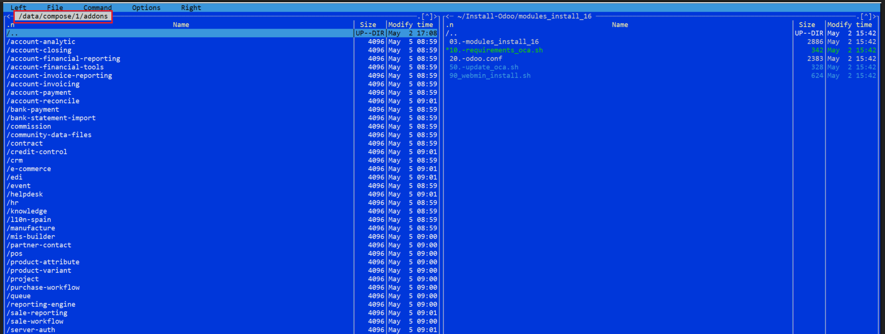

Una vez que estemos en la ruta debemos crear un nuevo directorio pulsando en el menú inferior el número 7 "Mkdir" o pulsando F7. A este nuevo directorio le llamaremos "otros". **Importante, al crear el directorio evitar encontraros encima de ningún archivo, hacedlo cuando tengais seleccionado "/..". De esta manera, podréis evitar posibles problemas.**

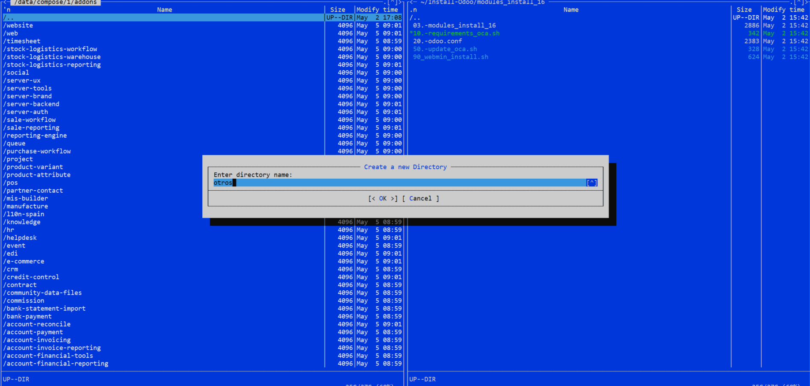

Creada la carpeta, salimos de Midnight Commander pulsando en el panel inferior en el número 10 "Quit" o pulsando en F10. Y una vez quitado Midnight Commander, hacemos en la consola un reboot.

```
reboot
```

Seguidamente, accedemos a Portainer donde debemos introducir de nuevo las credenciales debido al reboot. Si no la pide, recargar la página para que os echen y os la pida.

Una vez que accedáis a Portainer, entráis en vuestro environments "local" y accedéis a containers donde podréis acceder mediante el acceso directo que aparece en el dashboard o mediante el panel lateral izquierdo.


Una vez dentro, seleccionáis vuestro container "odoo16-web-1" y pulsáis en el botón superior "Restart"


Una vez instaladas las librerías de apoyo, ya podremos acceder al Odoo vía IP con el puerto 8069 o 8072.

La contraseña maestra de vuestro Odoo será 00000000

Aunque antes de realizar la creación de la base de datos de Odoo, realizaremos la Instalación NGINX Proxy Manager y copiaremos unos módulos extras que serán necesarios en Odoo.

Primero, copiaremos estos módulos extras y, para ello, volvemos a la consola y entramos en Midnight Commander.

```
mc
```

Ahora, en el panel de la izquierda nos dirigimos al directorio root/Install-Odoo/modulos_extras y en el panel de la derecha nos ubicaremos en el directorio data/compose/1/addons

Recordad, para comprobar que estamos en los directorios correctos nos fijamos en el directorio que nos indica en la parte superior de cada panel.

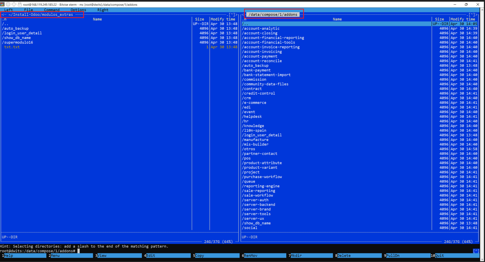

Una vez comprobado que estamos en el directorio correcto, copiaremos las siguientes carpetas del panel de la izquierda al panel de la derecha:

- auto_backup

- login_user_detail

- show_db_name

- supermodulo16

Recordad, para copiar las carpetas debemos pulsar en el botón inferior número 5 "Copy" o pulsar F5. Seguidamente, nos aparecerá una ventana de diálogo donde la ruta to deberá ser la misma que el directorio de la derecha y una vez comprobado que así sea, pulsamos en el botón "OK"

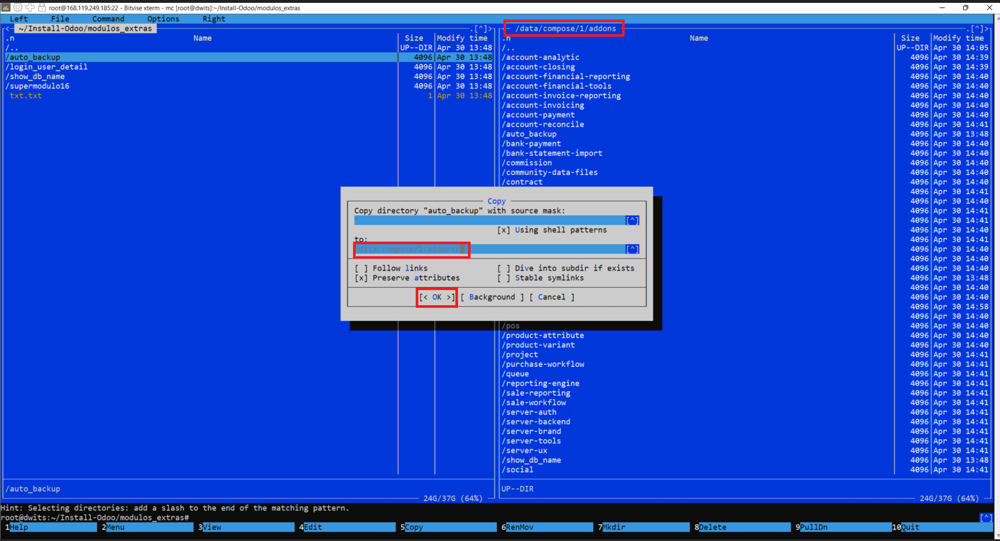

Una vez copiada todas las carpetas, pulsamos en el panel inferior al número 10 "Quit" o pulsamos en F10. 

Una vez copiado nos aseguraramos que en el archivo **odoo.conf** su filtro **dbfilter = ^%d_.*** 

Para ello, accedemos en el panel de la izquierda en el directorio data/compose/1/config donde tendremos acceso al archivo odoo.conf. Para acceder a este, nos situamos en el archivo y pulsamos en el panel inferior el número 4 "Edit" o pulsando F4.


Una vez dentro del archivo se cambia dbfilter=^%d$ por dbfilter = ^%d_.*

- Archivo odoo.conf antes del cambio

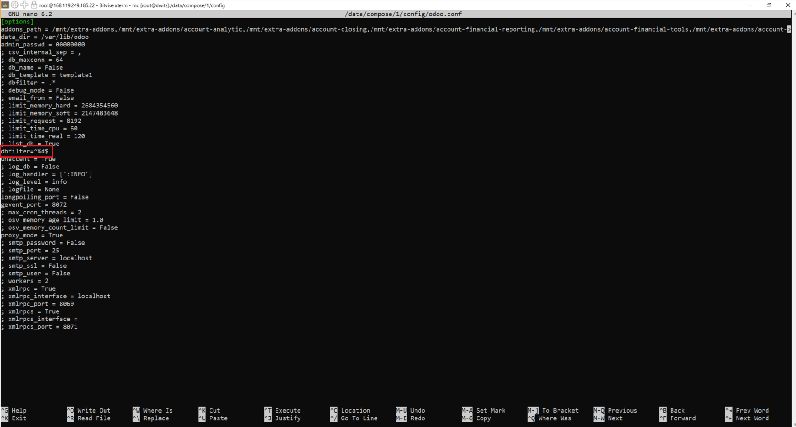

- Archivo odoo.conf cambiando el fitro. En la imagén podréis ver como se realiza el cambio.


Una vez cambiado el archivo, salimos de Midnight Commander y reiniciamos el servidor con reboot.

```
reboot
```

## 7.Instalación NGINX Proxy Manager

Podemos acceder al configurar el Nginx a través del container nginx-app-1 haciendo click a la url del puerto 81.


Al acceder a Nginx nos pedirá las credenciales de acceso:

email: admin@example.com

Password: changeme


Una vez dentro nos pedirá que cambiemos el correo de acceso donde le indicaremos el correo electrónico que nos facilite Data Control para la creación de los servidores de Odoo.


Una vez cambiado el correo nos pedirá que cambiemos la contraseña.


Una vez cambiada la contraseña accederemos a Hosts/Proxy Hosts que será donde accederemos para crear los certificados SSL de los distintos registros A que hemos creado con el Excel facilitado para esta función.

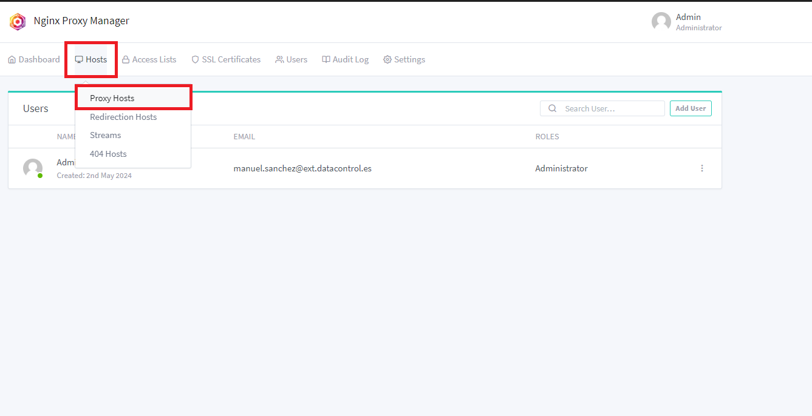

Una vez dentro de esta sección, para añadir los distintos registros A para posteriormente crear sus certificados SSL, debemos pulsar en el botón "Add Proxy Host".

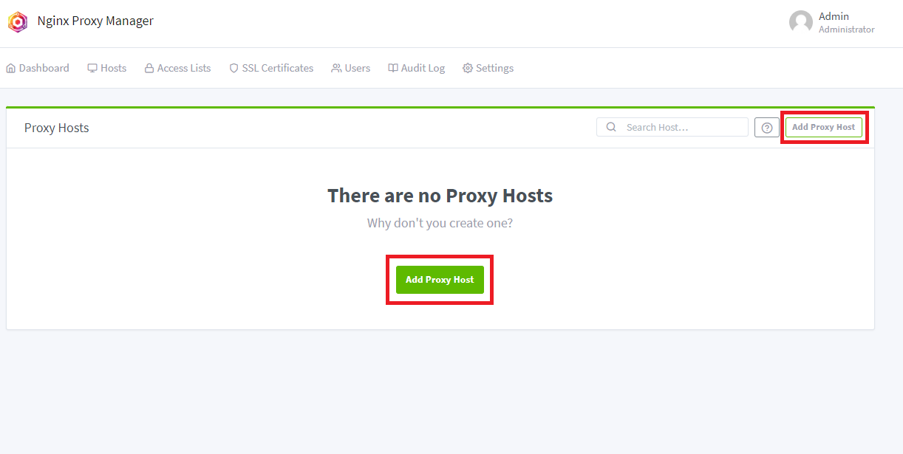

Al pulsar este botón nos aparecerá una ventana emergente donde debemos añadir en "Domain Names" el registro A generado en Excel, en "Forward Hostname / IP" será la IP generada por nuestro servidor Hetzner y el "Forward Port" y, por último, dejamos seleccionado "Block Common Exploits".

A continuación, veremos como se añade cada uno de los registros A que debemos añadir para el Odoo que estamos levantando.

- Registro A de Odoo:

Primero tomamos el registro A de Odoo generado con el Excel:

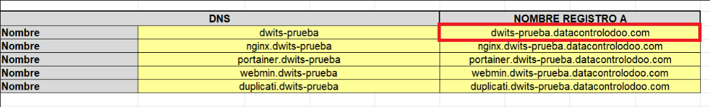

Generamos el Proxy Host de Odoo donde su "Forward Port" es 8069

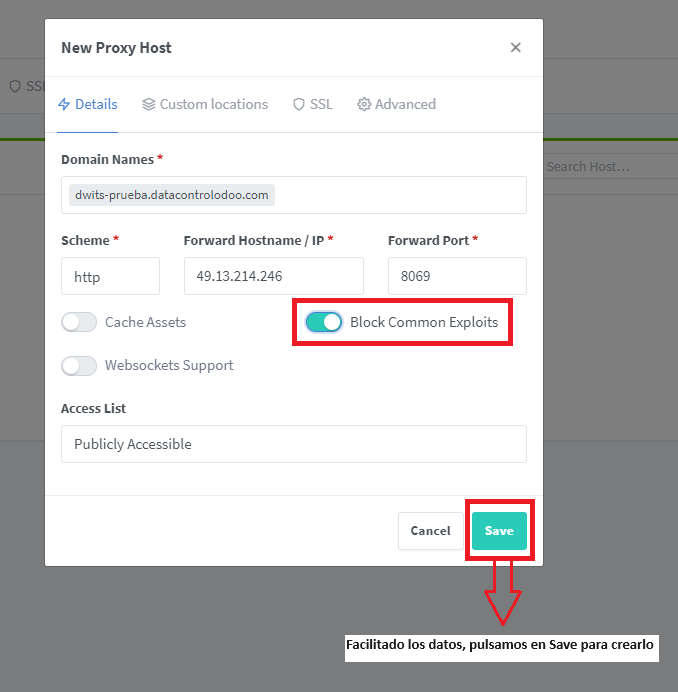

- Registro A de NGinx (Volvemos a pulsar en el botón "Add Proxy Host"):

Primero tomamos el registro A de NGinx generado con el Excel:

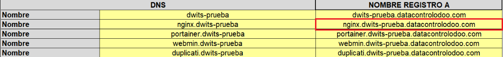

Generamos el Proxy Host de NGinx donde su "Forward Port" es 81.

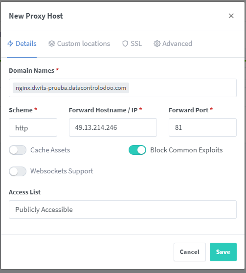

- Registro A de Portainer (Volvemos a pulsar en el botón "Add Proxy Host"):

Primero tomamos el registro A de Portainer generado con el Excel:

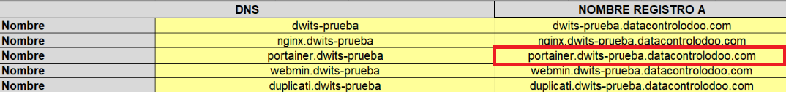

Generamos el Proxy Host de Portainer donde su "Forward Port" es 9000.

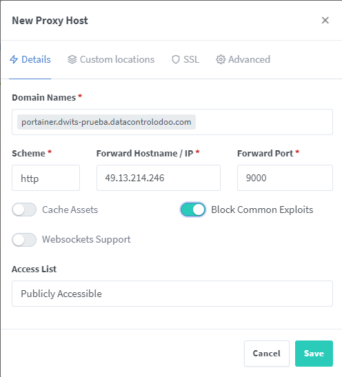

- Registro A de Webmin (Volvemos a pulsar en el botón "Add Proxy Host"):

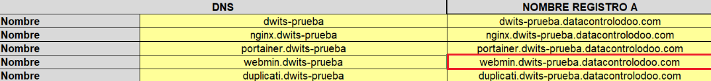

Generamos el Proxy Host de Portainer donde su "Forward Port" es 10000.

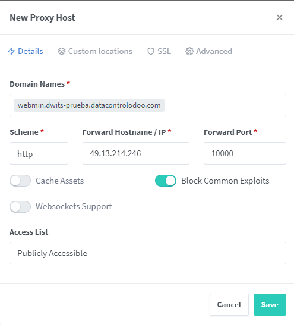

- Registro A de Duplicati (Se añadirán cuando tengamos la guía de las copias de seguridad).

Una vez añadido los registros A tendremos el siguiente panel:

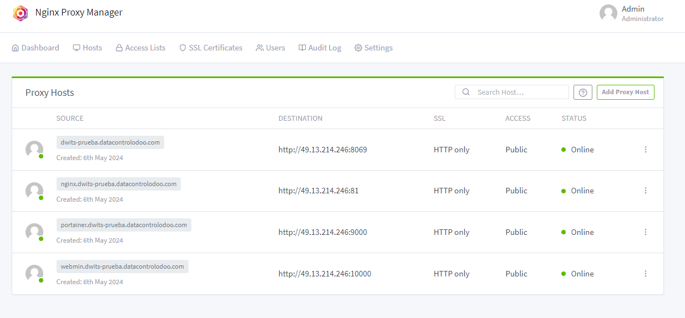

A continuación, crearemos certificado SSL a cada uno de los registros A. Para ello nos situaremos en el registro A que le vamos a crear el certificado SSL y pulsamos en los tres puntitos y le damos a "Edit". 

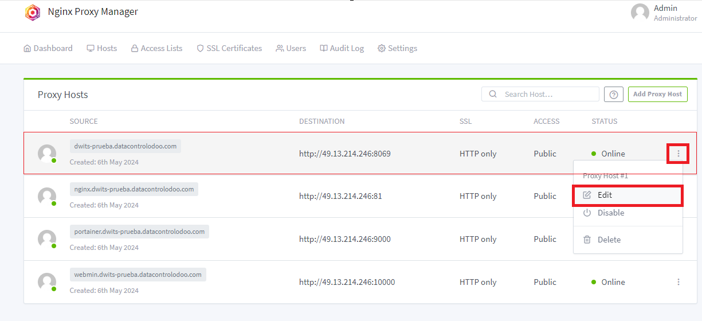

- Certificado SSL para el registro A de Odoo: En la pantalla emergente que nos aparece, pulsamos en el botón SSL y en el despegable "SSL Certificate" y seleccionamos "Request a new SSL Certificate". Por último, seleccionamos "Force SSL" y "I Agree to the Let's Encrypt Terms of Service". El apartado "Email Address for Let's Encrypt" dejamos el correo que viene por defecto, el cual será el correo que nos ha proporcionado Data Control para esta tarea y será el mismo que le indicamos a NGinx en la activación. Finalizada la configuración guardamos los cambios pulsando en el botón "Save".

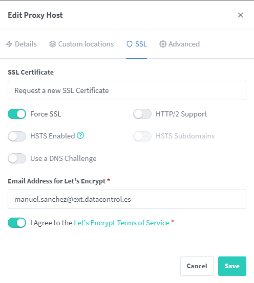

Realizamos la misma operación con el resto de registro A. Una vez se hayan agregado los hosts podremos fijarnos que la columna SSL aparecerá "Let's Encrypt":

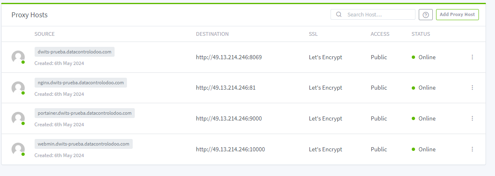

## 8. Instalación de librerías python necesarias para algunos módulos de Odoo

Lo primero que haremos será abrir el contenedor `odoo16-web-1` como usuario root para poder hacer las instalaciones necesarias.

```
docker exec -it --user root odoo16-web-1 bash
```

Después, instalamos la lista de paquetes e instala Python 3 pip.

```
 apt update && apt install -y python3-pip
```


Ahora, instalamos el paquete `pysftp` para Python 3, que proporciona una interfaz simple para transferir archivos mediante SFTP (Secure File Transfer Protocol).

```
pip3 install pysftp
```


Instalamos el paquete `schwifty` para Python 3, que facilita la validación y manejo de códigos IBAN y BIC en aplicaciones financieras.

```
pip3 install schwifty
```


Siguiente, se reinstala forzosamente una versión específica (3.4.8) del paquete `cryptography` para Python 3, incluso si ya está instalado.

```
pip3 install cryptography==3.4.8 --force-reinstall
```


Por último, instala las bibliotecas necesarias para trabajar con XML y HTML en Python. E instalamos el paquete `xmlsig` para Python 3, que proporciona soporte para la firma y validación de documentos XML según el estándar XML Signature (XMLDSIG).

```
apt update && apt install -y python3-lxml libxml2-dev libxslt-dev
```


```
pip3 install xmlsig
```


```
exit
```

```
reboot
```


saa

## 9. Creación base de datos de Odoo

Para la creación de la base de datos de Odoo hay que tener en cuenta que la contraseña maestra es siempre 00000000 y el nombre de la base de datos debe ser el nombre del subdominio creado en este caso dwits-prueba 

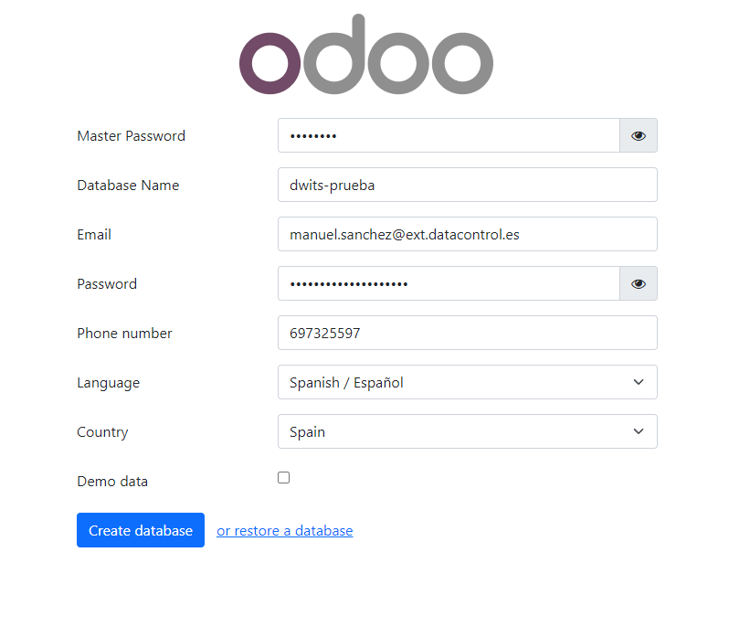
