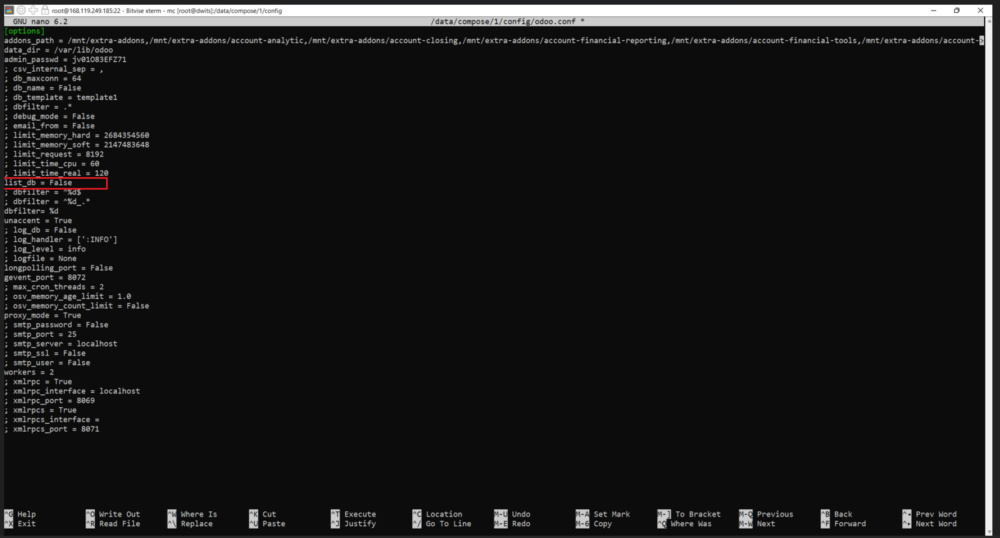

# PROTOCOLO DE CREACIÓN SERVIDOR PARA ODOO

## 1. Dar de alta el servidor en Hetzner

Cada técnico tiene creado un proyecto en el que poder crear servidores. Las características del servidor dependerán del tipo de servicio contratado:

### a. Gestión de procesos y Gestión de clientes

El servidor para los clientes que hayan contratado el servicio de gestión de clientes (KDGC) o el servicio de gestión de procesos (KDGP) contarán con un servidor propio con las siguientes características:

- Location: Falkenstein

- Image: Ubuntu 22.04

- Tipo: arquitectura Intel x86: CPX11

- Networking: IPv4 e IPv6

- Firewalls: Firewall 3 reglas (Se activará una vez finalizada toda la instalación de Odoo)

- Backups: YES

- Placement groups: crear grupos por cada 10 servidores creados (Es decir, en cada grupo debe haber un máximo de 10 servidores/clientes)

- Nombre: nombre del cliente

Para la creación de los servidores deberemos acceder a nuestra cuenta de Hetzner y facilitar las credecianles para iniciar sesión:


En algunas ocasiones nos llevará al servicio "Cloud" que es donde accederemos a nuestro proyecto para poder crear nuestros servidores. Aunque, en otras ocasiones nos llevará a otra ventana diferente y tendremos que ir nosotros manualmente al servicio "Cloud".

Ejemplo de iniciar sesión que no nos lleve al servicio "Cloud" y que debemos hacer para llegar a este servicio:


Una vez en el servicio cloud, accedemos al proyecto que nos ha facilitado Data Control:


Para crear un servidor debemos pulsar en el botón "Add Server" y nos llevará al sistema de configuración del Servidor:


Ejemplo de configuración del servidor (Aquellas configuraciones que no aparezcan significará que se dejarán sin configurar)


El siguiente pantallazo corresponde a los grupos, recordad 10 servidores por grupos. Podéis dejarle el nombre que os da Hetzner por defecto. 


Si no habéis creado nunca un grupo debéis seleccionar "Create placement group" para crear el grupo


### 

## 2. Instalaciones en el servidor

1. Primeros pasos en el terminal

Abrimos el terminal que utilicemos para conectar por SSH y añadimos la IP del servidor de Hetzner y el puerto 22.
Cuando entras por root a un servidor de Hetzner te solicita la contraseña que previamente te ha enviado al correo electrónico y que crees una contraseña nueva.


Una vez cambiada la contraseña, debemos actualizar la lista de paquetes disponibles de nuestro servidor Ubuntu y luego instalar las actuliaciones disponibles para los paquetes instalados.

```
sudo apt update && sudo apt upgrade
```

Durante la instalación nos pedirá confirmación para proseguir con la instalación de las actualizaciones donde para proseguir debemos indicar que sí (Y).

Una vez finalizada la tarea, nos solicita que reiniciemos los servicios marcados para que el servidor utilice los nuevos paquetes, donde le diremos "Ok".


También, os podría indicar que actualizase a una nueva versión de kernel:


Donde os indicará que algunos servicios están utilizando bibliotecas desactualizadas y necesitan ser reiniciados para aplicar las actualizaciones. Lo mejor es dejar los servicios seleccionados por defecto y proceder.


De una forma u otra, realizamos un reinicio del sistema operativo de manera segura y ordenada con el siguiente comando:

```
reboot
```

Una vez ejecutado el comando se desconectará nuestro terminal debiendo  conectarnos de nuevo. Importante, la contraseña de vuestro terminal seguirá teniendo la contraseña que nos dio el servidor y que como recordaréis la hemos cambiado, por ello os recomendamos que se cambie el campo password con la nueva contraseña que le hemos indicado a nuestro servidor Ubuntu.


- Para ejecutar la consola pulsamos en "New Terminal console".


2. Clonación intalación Odoo

A continuación, utilizaremos el comando que utiliza Git clonar (copiar) el repositorio remoto llamado "Install-Odoo" desde GitHub al directorio local actual en tu máquina. Esto te permite obtener una copia local completa del repositorio para trabajar con ella offline o hacer modificaciones.

```
git clone https://github.com/datacontrolTI/odoo_install.git
```

Al realizar la clonación nos solicitará un usuario y contraseña.


Una vez facilitado se descargará el repositorio de GitHub en el servidor. 

Configuración Inicial y Ejecución de Scripts para Odoo

- Empezamos cambiando el directorio actual al directorio llamado "Install-Odoo"

```
cd odoo_install
```


- Otorgamos permisos de ejecución a todos los archivos con extensión ".sh" en el directorio actual, de forma recursiva. Es decir, el comando se aplicará no solo a los archivos en el directorio actual, sino también a todos los archivos dentro de subdirectorios que estén bajo el directorio actual.

```
chmod -R +x *.sh
```

- Ejecutamos el script llamado "01_script.sh", el cual está diseñado para realizar configuraciones específicas, como configurar espacio de swap, instalación de Docker y Portainer, que es una herramienta de gestión para Docker.

```
./01_script.sh
```

Durante la ejecución de este script, nos realizará una serie de preguntas donde siempre deberemos de indicar que sí "Y".

- **Configuración del puerto para Portainer**: Una vez instalado Portainer, el script te informará sobre el puerto en el que Portainer está escuchando. Normalmente, Portainer se configura para utilizar el puerto 9000. Este puerto es donde podrás acceder a la interfaz web de Portainer.

- **Acceso a Portainer a través del navegador**: Para acceder a Portainer, debes abrir el navegador de tu elección y escribir la dirección IP del servidor seguida del puerto en el que Portainer está operando. Por ejemplo, si la dirección IP del servidor es `49.13.214.246` y Portainer está en el puerto `9000`, ingresarías `49.13.214.246:9000` en la barra de direcciones de tu navegador.
  
  Esto te llevará a la interfaz web de Portainer, donde puedes comenzar a configurar y gestionar tus contenedores Docker. Desde allí, podrás desplegar, monitorear y administrar contenedores, imágenes, redes, y volúmenes de Docker de manera intuitiva y eficiente.
  
  Este procedimiento facilita la gestión de entornos Docker, especialmente en escenarios donde se manejan múltiples contenedores, haciendo que la administración sea más accesible y visual.


Al poner la IP con el puerto (49.13.214.246:9000) te pedirá que establezcas una contraseña antes de entrar. Una vez dada, pulsamos en el botón "Crear usuario".


*Posible problema*


El mensaje que ves indica que la instancia de Portainer se ha desactivado temporalmente por motivos de seguridad, probablemente debido a que la sesión inicial de configuración superó el tiempo máximo permitido sin actividad. Esto es una medida de seguridad para prevenir accesos no autorizados durante la configuración inicial.

**Para resolver este problema y continuar con la configuración de Portainer, sigue estos pasos:**

- **Reiniciar Portainer**: Necesitas reiniciar el servicio de Portainer en el servidor. Esto dependerá de cómo Portainer esté desplegado (por ejemplo, como un contenedor Docker). Un comando común para reiniciar Portainer si está corriendo en Docker sería:

```
docker restart [container_id]
```

Sustituye `[container_id]` con el ID del contenedor de Portainer. Si no conoces el ID, puedes obtenerlo con el comando:

```
docker ps
```


- **Acceder nuevamente**: Una vez reiniciado, vuelve a acceder a Portainer usando la URL en tu navegador con la dirección IP del servidor y el puerto especificado (generalmente 9000), como `49.13.214.246:9000`. (Sustituye la IP por la de tu servidor)

- **Crear el usuario rápidamente**: Completa el formulario de creación de usuario lo más pronto posible para evitar otro timeout.

Una vez creado el usuario satisfactoriamente, se te redirigirá la página al menú principal.


### Añadir entorno

1. **Acceso al apartado Environments**: En la interfaz de usuario de Portainer, utiliza el menú lateral para navegar al apartado "Environments". Este apartado permite gestionar diferentes entornos donde tus contenedores y servicios van a operar.
   
   

2. **Configuración del entorno**: Dentro del environments que vendrá creado por defecto "local", debes añadir la dirección IP de tu servidor. Esto permite a Portainer conectar y gestionar los contenedores en ese servidor específico. Tras facilitar la IP, pulsaremos en el botón "Update Environment" para que se actualice la información y la IP quede guardada.
   
   

3. **Creación de Stacks**: Una vez que el entorno está configurado, deberemos crear los diferentes stacks necesarios para la instación de Odoo y será el stack "Odoo 16" y stack "NGinx".
   
   Para ello debemos volver al menú principal pulsando en "Home". Y en el menú principal accederemos al environments que se nos ha creado por defecto llamado "local", que es el mismo al que le acabamos de facilitar la IP.
   
   
   
   Una vez accedido al environment, debemos acceder al apartado "Stack" bien en el menú lateral o con el acceso directo que nos aparece en la pantalla principal del environments "local".
   
   
   
   Al acceder, veremos que ya hay un stack creado de forma predeterminada llamado "portainer" el cual permitirá su administración, probablemente relacionado con la instancia de Portainer misma. Aquí, debes proceder a añadir más stacks para tus aplicaciones pulsando en el botón superior del extremo derecho llamado "+ Add Stack".
   
   
   
   A continuación, indicaremos como añadir cada uno de los stacks a través del siguiente enlace [odoo_install/docker at main · datacontrolTI/odoo_install · GitHub](https://github.com/datacontrolTI/odoo_install/tree/main/docker):
   
   
   
   - **Odoo 16**:
     
     - **Localización del archivo de instalación**: Dentro del repositorio de GitHub al que accedes mediante el enlace anterior, encuentra el archivo `odoo16.txt`, el cual contiene el código necesario para la instalación de Odoo 16.
     
     - **Configuración del stack**: Accede a la creación del Stack y facilita primero su nombre "Odoo16" y en su editor web (Web Editor) pega el contenido del archivo `odoo16.txt`
     
     
     
     - **Passwordd PostrgreSQL**: Ahora en el campo Web Edito localizamos los valores **POSTGERS_PASSWORD** y modificamos el valor **odoo** por una contraseña segura que generemos.
     
     
     
     Ejemplo de contraseña segura:
     
     
     
     - **Desarrollo del Stack**: Finaliza la configuración del stack dando clic en el botón "Deploy the stack", lo que iniciará el proceso de despliegue de Odoo 16 en el entorno configurado.
- **NGinX**:
  
  - **Localización del archivo de instalación**: Similar al proceso de Odoo, encuentra el archivo `nginx.txt` en el mismo repositorio de GitHub al que accedes mediante el enlace facilitado.
  
  - **Configuración en Portainer**: Accede a la creación del Stack y facilita primero su nombre "nginx" y en su editor web (Web Editor) pega el contenido del archivo `nginx.txt`.
  
  
  
  - **Desarrollo del Stack**: Al igual que con Odoo, finaliza la configuración y lanza la instalación de NGinX haciendo clic en el botón "Deploy the stack".

Una vez instalado los dos stacks, deben encontrarse estos dos en la tabla "Stack list".


## 5. Instalación de los módulos OCA y copia del archivo de configuración de Odoo

El siguiente paso será ejecutar en consola el script 02_script.sh

- Cerramos consola


- Nos desconectamos del servidor pulsando en el botón "Log Out".
  
  

- Nos volvemos a conectar al servidor pulsando en el botón "Log in" y abrimos una nueva consola.
  
  

- Para ejecutar la consola pulsamos en "New Terminal console".


- A continuación, ejecutamos el siguiente comando

```
/root/odoo_install/02_script.sh
```

Con el comando anterior a todo lo que pregunte responder si (Y).

Una vez finalizada la ejecución, debemos hacer un reboot

```
reboot
```

Al realizar el reboot, tendremos que cerrar la consola y volveremos a conectanos. 

- Cerramos consola


(La imagen utilizada ha sido reusada de pantallazos anterior, por lo tanto, no os fijeis del código que aparece)

- Nos desconectamos del servidor pulsando en el botón "Log Out".
  
  

- Nos volvemos a conectar al servidor pulsando en el botón "Log in" y abrimos una nueva consola.


Para ejecutar la consola pulsamos en "New Terminal console".


Una vez dentro de la consola cambiamos el directorio actual a `/root/odoo_install/modules_install_16`, que es donde se ubican los scripts de instalación de módulos y otorgamos permisos de ejecución al archivo `10.-requirements_oca.sh`, permitiendo que sea ejecutado como un script.

```
cd /root/odoo_install/modules_install_16
```

```
chmod +x 10.-requirements_oca.sh
```

A continuación, reiniciamos el servidor.

```
reboot
```

Seguidamente, accedemos a Portainer donde debemos introducir de nuevo las credenciales debido al reboot. Si no la pide, recargar la página para que os echen y os la pida.

Una vez que accedáis a Portainer, entráis en vuestro environments "local" y accedéis a containers donde podréis acceder mediante el acceso directo que aparece en el dashboard o mediante el panel lateral izquierdo.


Una vez dentro, seleccionáis vuestro container "odoo16-web-1" y pulsáis en el botón superior "Restart"


Volvemos a la consola y entramos en Midnight Commander donde nos aseguraramos que en el archivo **odoo.conf** su filtro **dbfilter = %d**

```
mc
```

Para ello, accedemos en el panel de la izquierda en el directorio data/compose/1/config donde tendremos acceso al archivo odoo.conf. Para acceder a este, nos situamos en el archivo y pulsamos en el panel inferior el número 4 "Edit" o pulsando F4.


Antes de acceder a editar el archivo nos solicitará que editor de texto queremos:


Donde elegiremos la opción número 1 /bin/nano/ o lo que es lo mismo, seleccionamos nano porque es un editor de texto sencillo, fácil de usar y tiene funciones esenciales para editar archivos en un entorno de línea de comandos. Donde nos aparecerá la siguiente pantalla:

Una vez dentro del archivo nos aseguramos que el filtro dbfilter=%d esta sin comentar y dejando el primero comentado (para comentar se añade punto y coma antes del filtro).

Además, se cambia la contraseña del filtro admin_passwd = 00000000 por otra contraseña de ochos caracteres o más, generado por un generador de contraseñas. (Podemos usar el generador https://www.lastpass.com/es/features/password-generator ). Esta contraseña será la que usemos posteriormente como contraseña maestra de la base de datos del odoo que estáis montando.

Por otro lado, nos aseguramos que los siguientes filtros esten correctos y lo dejamos sin comentar:

- limit_time_real = 600

- workers = 2


Una vez cambiado el archivo, salimos del editor pulsando en control+o y pulsamos la tecla intro (de esta manera, habremos guardado los cambios). Después, salimos del editor con ctrol+x. 

 Salimos del Midnight Commander pulsando en F10 o pulsando con el ratón al número "10Quit", y reiniciamos el servidor con reboot.

```
reboot
```

## 6.Instalación NGINX Proxy Manager

Podemos acceder al configurar el Nginx a través del container nginx-app-1 haciendo click a la url del puerto 81.


Al acceder a Nginx nos pedirá las credenciales de acceso:

email: admin@example.com

Password: changeme


Una vez dentro nos pedirá que cambiemos el correo de acceso donde le indicaremos el correo electrónico que nos facilite Data Control para la creación de los servidores de Odoo.


Una vez cambiado el correo nos pedirá que cambiemos la contraseña.


Una vez cambiada la contraseña anotaremos la url y las credenciales de acceso para facilitarsela a los implementadores. La url siempre se corresponderá a la IP del servidor seguido de 81. Siguiendo nuestro ejemplo, la url es 49.13.214.246:81

## 7. Instalación de librerías python necesarias para algunos módulos de Odoo

Lo primero que haremos será abrir el contenedor `odoo16-web-1` como usuario root para poder hacer las instalaciones necesarias.

```
docker exec -it --user root odoo16-web-1 bash
```

Después, instalamos la lista de paquetes e instala Python 3 pip.

```
 apt update && apt install -y python3-pip
```


Ahora, instalamos el paquete `pysftp` para Python 3, que proporciona una interfaz simple para transferir archivos mediante SFTP (Secure File Transfer Protocol).

```
pip3 install pysftp
```


Instalamos el paquete `schwifty` para Python 3, que facilita la validación y manejo de códigos IBAN y BIC en aplicaciones financieras.

```
pip3 install schwifty==2024.4.0
```


Siguiente, se reinstala forzosamente una versión específica (3.4.8) del paquete `cryptography` para Python 3, incluso si ya está instalado.

```
pip3 install cryptography==3.4.8 --force-reinstall
```


Por último, instala las bibliotecas necesarias para trabajar con XML y HTML en Python. E instalamos el paquete `xmlsig` para Python 3, que proporciona soporte para la firma y validación de documentos XML según el estándar XML Signature (XMLDSIG).

```
apt update && apt install -y python3-lxml libxml2-dev libxslt-dev
```


```
pip3 install xmlsig
```


```
exit
```

```
reboot
```


## 8. Pasos finales

Una vez que los implementadores nos notifiquen que han finalizado la instalación del Odoo de su cliente, volveremos a la consola y entramos en Midnight Commander para modificar nuevamente el archivo odoo.conf (su ruta es /data/compose/1/config) donde se modificará el filtro list_db = False y se deja sin comentar. Con este cambio, ocultaremos en el panel de iniciar sesión de Odoo la gestión de base de datos. De esta manera, crearemos una medida de seguridad para evitar que conozcan la contraseña maestra de la base de datos mediante fuerza bruta.



Seguidamente, se accede al servidor de Hetzner y se crea una regla de Firewall donde la configuración debe ser la siguiente:


Una vez creada, accederemos a la maquina del cliente y le asignamos la regla que hemos creado (Esta regla solo se tendrá que crear una vez y ser usada para el resto de clientes)


Para que nos aparezca esta regla en la maquina seleccionada, debemos de esperar un par de minutos. (La mayoría de las veces se debe de recargar la página para que nos aparezca)
